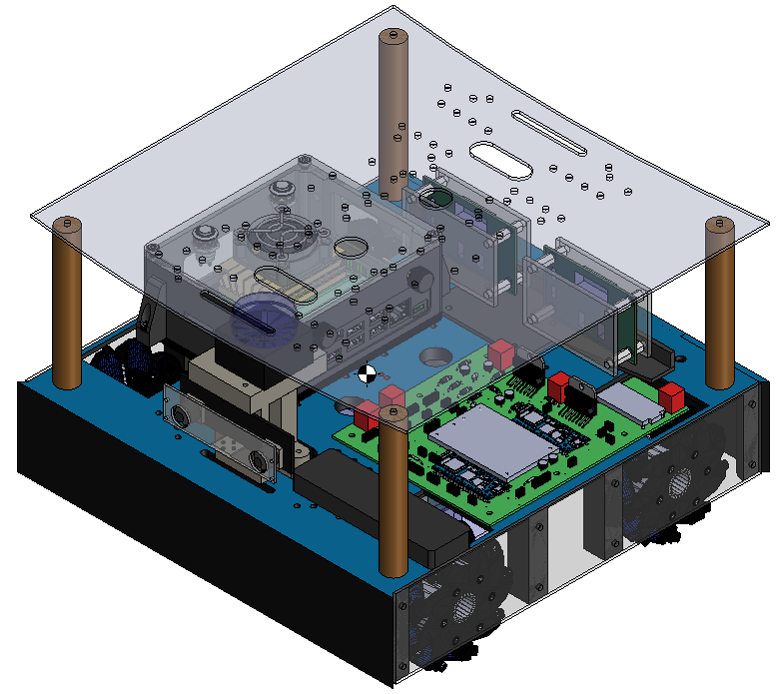
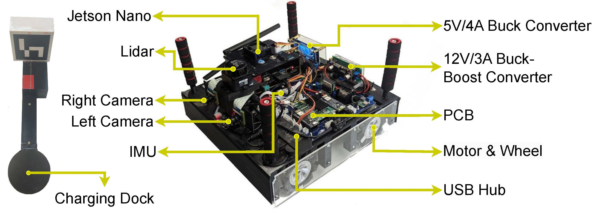

<a name="readme-top"></a>


<!-- PROJECT LOGO -->
<br />
<div align="center">
  <a href="https://github.com/shihab28/omobot_js">
    
  </a>

  <h1 align="center">Omobot</h1>
  <p align="center">
    <!-- <a href="omobot.docs"><strong>Check the full documentation»</strong></a>
    <br /> -->
    <a href="https://shorturl.at/AD019">View Demo</a>
    <br />
    <!-- · -->
    <!-- <a href="https://github.com/othneildrew/Best-README-Template/issues">Report Bug</a> -->
    <!-- · -->
    <!-- <a href="https://github.com/othneildrew/Best-README-Template/issues">Request Feature</a> -->
  </p>
</div>


<!-- TABLE OF CONTENTS -->
<details>
  <summary>Table of Contents</summary>
  <ol>
    <li><a href="#about-the-project">About The Project</a></li>
    <li>
      <a href="#installation">Installation</a>
      <ul>
        <li><a href="#dependencies">Dependencies</a></li>
        <li><a href="#clone-the-repository">Clone the Repository</a></li>
        <li><a href="#build-the-package">Build the Package</a></li>
      </ul>
    </li>
    <li><a href="#files-structure">Files Structure</a></li>
    <li>
      <a href="#jetson-nano-setup">Jetson Nano Setup</a>
      <ul>
        <li><a href="#system-dependencies">System Dependencies</a></li>
      </ul>
    </li>
  </ol>
</details>


<!-- ABOUT THE PROJECT -->
## About The Project
<div align="center">
 <br />
</div>

<div align="justify">
Omobot is an ros-based autonomous Omnidirectional MObile-roBOT developed for periodically exploring indoor rooms, monitor people, detecting anamoly (human-fall), and sending an email/text to a set of designated responders in case of any anamoly detection. This repository contains a walkthrough of Omobot's software integration with the hardware systems. 
<br />
<div align="justify">

<p align="right">(<a href="#readme-top">back to top</a>)</p>


<!-- Installation -->
## Installation
Ensure that ROS Melodic and Python 2.7 are installed on your system. Follow the ROS Melodic installation instructions available at http://wiki.ros.org/melodic/Installation. To use in Jetson Nano, install jetpack 4.6.4 following the instruction at https://developer.nvidia.com/jetpack-sdk-464.

### Dependencies
- Jetson Jetpack 4.6.4 
- ROS Melodic
- Python 2.7
- Required ROS packages (listed in package.xml)


### Clone the Repository
Clone the repository for the root workspace.
```sh
  git clone https://github.com/shihab28/omobot_js.git
  cd omobot_js/src
  git clone https://github.com/ldrobotSensorTeam/ldlidar_stl_ros.git 
  git clone https://github.com/OSUrobotics/mpu_6050_driver.git
  cd ../
```

### Ros-Melodic Dependencies
Install the ros melodic dependencies

```sh
sudo apt-get install -y ros-melodic-rosserial-arduino  ros-melodic-gscam 
sudo apt-get install -y ros-melodic-serial ros-melodic-joy ros-melodic-joy-teleop ros-melodic-twist-mux ros-melodic-move-base ros-melodic-amcl ros-melodic-map-server ros-melodic-map-laser 
sudo apt-get install -y ros-melodic-aruco-ros ros-melodic-aruco-detect ros-melodic-image-pipeline 
```


### Build the Package
Build the package using catkin_make and source the setup.bash from devel folder
```sh
catkin_make
source devel/setup.bash
```


<!-- Files Structure -->
## Files Structure

omobot_js/
- README.md
- mobot_ws.code-workspace
- omobot.docs --> "Detailed Comumentation of the robot"
- push.sh --> "Script use to push to github repository"
- setupEnviroment.sh --> "Script to setup the the robot"
+ src/ --> "Contains the source files of the project"
    - CMakeLists.txt
    + mobot_pkg/ --> "Main package of the robot"
        - CMakeLists.txt
        + arduino/
            + EncoderReading/
                - EncoderReading.ino    --> "Arduino code for the microcontroller that controls the encoder data"
            + MotorMovement/
                - MotorMovement.ino     --> "Arduino code for the microcontroller that controls motors"
        + config/
            - camera_0.yaml           --> "Intrinsic parameter of the camera connected to video0 port"
            - camera_1.yaml           --> "Intrinsic parameter of the camera connected to video1 port"
            - mobot.rviz              --> "Rviz Config for visualization"
            - omobot.yaml             --> "Robot's physical configuration"
            - slam_parameter.yaml     --> "COnfiguration used for SLAM and map generation"
            - twist_mux_config.yaml   --> "COnfiguration used for twist mux between twist inputs (keyboard, joystick, move_base)"
            - twist_mux_locks.yaml    --> "Twist locks configuration"
            - twist_mux_topics.yaml   --> "Twist topic configuration"
        + dep/
            - pipList                 --> "List of python packeges"
            - rosDepList              --> "List of depended package list"
        + extra/ --> "Contains some supporting scripts and data"
        + gazebo/
            - gazebo_control.xacro    --> "Gazebo controller for simulation"
        + launch/
            - amcl.launch             --> "Launch file for localization"           
            - aruco_detector.launch   --> "Launch file for aruco marker detection for wireless charging dock"    
            - gazebo_sim.launch       --> "Launch file for gazebo simulation"       
            - gscam_csi.launch        --> "Launch file for starting mono csi camera"
            - gscam_csi_stereo.launch --> "Launch file for starting stereo csi camera"
            - lidarLD19.launch        --> "Launch file for Lidar LD19"
            - mapping.launch          --> "Launch file for creating maps"
            - navigation.launch       --> "Launch file for starting navigation"
            - twist_mux.launch        --> "Launch file for starting twist mux listener for the twist inputs"
        + maps/ --> "Maps file"
            - lab_map.pgm
            - lab_map.yaml
            - map_201.pgm
            - map_201.yaml
            - map_201_.pgm
            - map_201_lab.pgm
            - map_201_lab.yaml
        + meshes/ --> "Contains the graphical files"
            - OmobotVersion2.dae      --> "Mesh file of the main body of the robot"
            - Omobot_Assembly.jpg     --> "Figure of the assembled robot"
            - Omobot_Design.png       --> "3D Design of the robot"
            - Ros_logo.png            --> "ROS logo"
            - wheel_left.dae          --> "Mesh file of the wheels making 135 degree with x axis"
            - wheel_right.dae         --> "Mesh file of the wheels making  45 degree with x axis"
        + models/ --> "Gazebo simulation environment models"
            + Workshop/
                - model.config
                - model.sdf
            + maze1/
                - model.config
                - model.sdf
        + nav_param/ --> "Parameters for controlling navigation"
            - base_local_planner_params.yaml
            - costmap_common_params.yaml
            - dwa_local_planner_params.yaml
            - global_costmap_params.yaml
            - local_costmap_params.yaml
            - move_base_params.yaml
        - package.xml
        + robot/ 
            - omobot.xacro  --> "Xacro file of the robot"
        + services/
            - fan.service             --> "startup service for starting fan"
            - fan.sh                  --> "script to control fan speed"
            - kill_gazebo.sh          --> "stopping gazebo server and process"
            - kill_roscore.sh         --> "stopping roscore and processes"
            - pioled_stats.service    --> "startup service for displaying robot information in oled display"
        + src/
            + PoseDetection/
                - yolov8n-pose.pt       --> "pose detection weight"
            - controllerOmobot.py     --> "script to control the robot"
            - explorationNode.py      --> "script to start periodic indoor exploration"
            - fallDetector.py         --> "script to detect human fall"
            - getEncoderData.py       --> "script to read encoder feedback from arduino"
            - imageParser.py          --> "script to parsing image for fall detection"
            - keyboard_controller.py  --> "modified tele-op keyboard for omnidirectional movement"
            - pioledStats.py          --> "scripts to parse the jetson nano status and display in oled display"
            - rviz_click_to_2d.cpp    --> "parsing clicked point information from rviz"
            - startSerialNodees.py    --> "scripts to start serial communication with arduino"
            - wheel_pwm_controller.py --> "scripts to generate pwm signal for the motor"
        + urdf/ --> "urdf.xacro files used for the the robot simulation"
            + include/
                - _body.urdf.xacro 
                - _camera.urdf.xacro
                - _imu.urdf.xacro
                - _inertial.urdf.xacro
                - _lidar.urdf.xacro
                - _material.urdf.xacro
                - _wheel.urdf.xacro
            - omobot.urdf.xacro
        + worlds/ --> "gazebo world files for simulation" 
            - garaze.world
            - lab.world
            + lab_long/
                - model.config
                - model.sdf
            + maze/
                - model.config
                - model.sdf
            - maze_world.world
            - world.launch

<p align="right">(<a href="#readme-top">back to top</a>)</p>


<!-- Jetson Nano Setup -->
## Jetson Nano Setup
Install jetpack 4.6.4 following the instruction at https://developer.nvidia.com/jetpack-sdk-464 on the Jetson Nano.

### System Dependencies

Install the system dependencies.
```sh
sudo apt-get update
sudo apt-get install python3.6-dev
sudo apt-get install python2-pip 
sudo apt-get install python3-pip
python -m pip install --upgrade pip setuptools wheel
python3 -m pip install --upgrade pip setuptools wheel 
python3 -m pip install  python-apt ubuntu-drivers-common
python3 -m pip install Jetson.GPIO jetson-stats Adafruit-GPIO Adafruit-SSD1306 adafruit-circuitpython-mpu6050  
python3 -m pip install ssh-import-id  systemd-python system-service
python3 -m pip install pyserial pyserial-asyncio asyncio
python2 -m pip cython opencv-python numpy pandas matplotlib pillow
python3 -m pip cython opencv-python numpy pandas matplotlib pillow
sudo apt-get update
sudo apt install openssh-server
sudo apt install openssh-client
sudo apt install sysstat
sudo apt-get install v4l-utils
sudo apt install -y ubuntu-restricted-extras
sudo apt-get install -y blueman 
```


<p align="right">(<a href="#readme-top">back to top</a>)</p>


<!-- [ros_logo]: -->